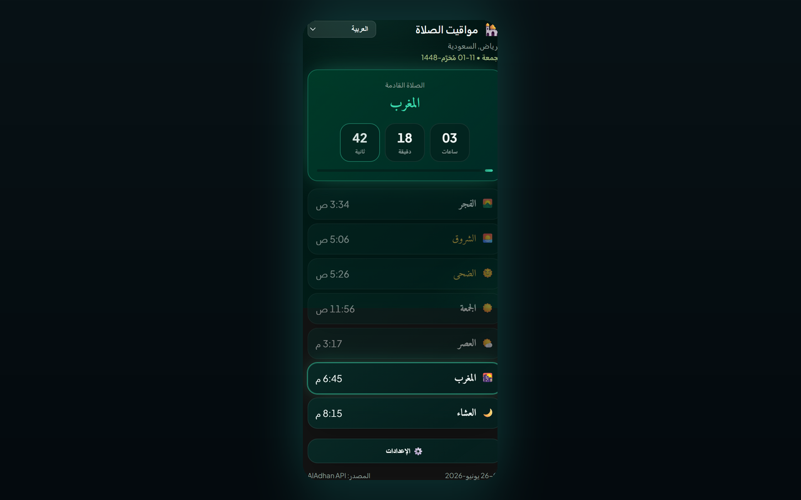

# Prayer Times Reminder — Chrome Extension (العربية)

> **استراحة مواقيت الصلاة** — عند حلول وقت الصلاة، تُقفل تبويباتك المفتوحة لتبتعد عن الشاشة وتؤدّي الصلاة.

إضافة Chrome (Manifest V3) تقوم بـ:

- 🔔 **إرسال إشعار عند حلول وقت كل صلاة** (Fajr, Dhuhr, Asr, Maghrib, Isha) — باللغة التي تختارها.
- 🔒 **قفل اختياري للتبويب** — عند حلول وقت الصلاة، يمنع جميع تبويبات المتصفح المفتوحة لمدة قابلة للضبط (من 1 إلى 120 دقيقة، الافتراضي 5) مع شاشة عدّاد تنازلي؛ كما تُقفل تلقائيًا أي تبويبات تفتحها أو تنتقل إليها أثناء فترة القفل؛ مع إمكانية الفتح يدويًا عبر زر الإغلاق.
- 🕌 **عرض جدول الصلوات اليومي بالكامل** لمدينتك/بلدك مع عدّاد حي للصلاة التالية.
- 🌍 **قوائم منسدلة للدولة والمدينة** — اختر الدولة وسيتحمّل تلقائيًا قائمة المدن.
- 🌐 **8 لغات** — قم بالتبديل من هيدر الـ popup أو **Settings → Language** (انظر [Supported languages](#supported-languages)).
- 🌗 **المظهر** — Midnight Emerald (افتراضي) أو Classic — قابل للاختيار من الإعدادات.
- 📅 **تنسيق التاريخ** — اختر طريقة عرض التاريخين الهجري والميلادي معًا (مثل `10-04-2026`, `10 April 2026`, نص طويل).
- 🌙 **التاريخ الهجري** يظهر بجانب التاريخ الميلادي.
- 📿 **ذكر دوري** — تذكير عائم اختياري مع 139 عبارة فريدة على التبويب النشط؛ اضغط لإخفائه أو سيتختفي تلقائيًا بعد 10 ثوانٍ.

[English](README.en.md) · [Deutsch](README.de.md) · [العربية](README.ar.md) · [اردو](README.ur.md) · [Français](README.fr.md) · [Español](README.es.md) · [हिन्दी](README.hi.md) · [Bahasa Indonesia](README.id.md)

تأتي أوقات الصلاة من واجهة [AlAdhan API](https://aladhan.com/prayer-times-api) المجانية؛ وقائمة المدن من [CountriesNow API](https://countriesnow.space) المجانية. لا تتطلب أي مفاتيح API.

## التثبيت

**التثبيت من متجر Chrome الإلكتروني (مُستحسن):** [أضِف إلى Chrome](https://chromewebstore.google.com/detail/prayer-times-reminder/knahkbkmbjghaiillhngjbhoinmeegoc)

أو حمّلها غير محزومة لأغراض التطوير:

1. افتح `chrome://extensions` في Chrome.
2. فعّل **Developer mode** (من أعلى اليمين).
3. اضغط **Load unpacked** واختر هذا المجلد.
4. اضغط على أيقونة الإضافة في شريط الأدوات لفتح الـ popup.
5. اضغط **⚙️ Settings**، اختر **Country** ثم **City** من القوائم المنسدلة (أو اضغط **📍 Use my location**)، اختر طريقة الحساب ثم **Save & Load**.
6. اختر اللغة من القائمة المنسدلة داخل هيدر الـ popup (أو من **Settings → Language**).

عند التثبيت لأول مرة، سيتم فتح صفحة ترحيبية تعرض خطوات **تثبيت الإضافة** في شريط أدوات Chrome (Chrome لا يسمح للإضافات بتثبيت نفسها تلقائيًا).

هذا كل شيء — ستقوم الإضافة بجلب أوقات اليوم وعرضها، ثم جدولة إشعار لكل صلاة قادمة. سيتم تحديثها تلقائيًا بعد منتصف الليل لليوم الجديد.

> **الإشعارات:** تأكد من السماح لـ Chrome بعرض الإشعارات النظامية في إعدادات نظام التشغيل؛ وإلا فلن تظهر التنبيهات.

## الإعدادات

| الإعداد | الوصف |
|---------|-------|
| الدولة / المدينة | الموقع المستخدم لاحتساب أوقات الصلاة (أو استخدام تحديد الموقع). |
| طريقة الحساب | طريقة AlAdhan (ISNA, Muslim World League, Umm al-Qura, Egyptian, Karachi, Diyanet, وغيرها). |
| تنسيق التاريخ | كيف يظهر التاريخان الهجري والميلادي معًا. |
| شكل الأرقام | عند تفعيل العربية أو الأردو: أرقام Arabic-Indic (٠١٢٣) أو الأرقام الغربية (0123) للأوقات والعدّاد التنازلي. |
| قفل التبويب أثناء الصلاة | يحقن طبقة تغطية على كامل الصفحة في جميع التبويبات المفتوحة عند وقت الصلاة. |
| مدة القفل | المدة التي يبقى فيها التبويب مقفولًا (1–120 دقيقة). |
| السماح بالفتح يدويًا | يظهر زر إغلاق (×) لإخفاء شاشة القفل مبكرًا. |
| اختبار قفل التبويب | معاينة طبقة القفل في التبويب الحالي (تعمل في مواقع عادية وليست صفحات `chrome://`). |
| ذكر دوري | يعرض ذكرًا عشوائيًا على التبويب النشط ضمن فترة ثابتة أو عشوائية (1–120 دقيقة). |
| موقع الذكر | زاوية أو وسط الصفحة (أعلى/أسفل × يسار/يمين/وسط). |
| اختبار الذكر | معاينة بطاقة الذكر في التبويب الحالي. |
| المظهر | اختر **Midnight Emerald** (افتراضي) أو **Classic**. |
| اللغة | اختر لغة الواجهة (متاحة أيضًا في هيدر الـ popup). |

## اللغات المدعومة

يتم ترجمة واجهة المستخدم والإشعارات وطبقة القفل وبطاقة الذكر وصفحة الترحيب. يمكنك تغيير اللغة من قائمة هيدر الـ popup أو من **Settings → Language**.

| الكود | اللغة | الاتجاه | ملاحظات |
|------|--------|---------|---------|
| `en` | English | LTR | القيمة الافتراضية عند غياب نص |
| `de` | Deutsch (German) | LTR | |
| `ar` | العربية (Arabic) | RTL | الافتراضي عند التثبيت الأول؛ مع خيار الأرقام Arabic-Indic (٠١٢٣) |
| `ur` | اردو (Urdu) | RTL | مع خيار الأرقام Arabic-Indic (٠١٢٣) |
| `hi` | हिन्दी (Hindi) | LTR | |
| `id` | Bahasa Indonesia | LTR | |
| `fr` | Français (French) | LTR | |
| `es` | Español (Spanish) | LTR | |

تعيش الترجمات في `i18n.js` (`I18N` + `SUPPORTED_LANGS`). عبارات الذكر في `tasbih-phrases.js` تتضمن العربية مع تسميات حسب اللغة إن كانت متاحة.

## الملفات

| الملف | الغرض |
|------|-------|
| `manifest.json` | ملف MV3 (صلاحيات: alarms, notifications, storage, geolocation, tabs, scripting). |
| `background.js` | خدمة خلفية (Service Worker) — جلب الأوقات، جدولة `chrome.alarms`، إرسال إشعارات مترجمة، وقفل جميع التبويبات المفتوحة عند وقت الصلاة. |
| `content-lock.js` | طبقة تغطية محقونة (shadow DOM) تمنع تفاعل الصفحة حتى ينتهي المؤقت أو يقوم المستخدم بفتح القفل يدويًا. |
| `content-tasbih.js` | بطاقة ذكر عائمة محقونة؛ تختفي عند الضغط عليها أو بعد 10 ثوانٍ. |
| `tasbih-phrases.js` | 139 عبارة ذكر فريدة. |
| `welcome.html` / `welcome.css` | صفحة الترحيب عند أول تثبيت مع تعليمات التثبيت في شريط الأدوات (مترجمة). |
| `i18n.js` | ترجمات مشتركة (EN/DE/AR/UR/HI/ID/FR/ES)، أسماء الصلوات، قائمة الدول، طرق الحساب، تنسيقات التاريخ، مساعد الأرقام. |
| `popup.html` / `popup.css` / `popup.js` | واجهة الـ popup (الجدول، العدّاد، اختيار اللغة، الإعدادات). |
| `icons/` | أيقونات الإضافة (هلال + نجمة). |
| `make_icons.py` | يعيد توليد أيقونات PNG (للتطوير فقط وليست مطلوبة وقت التشغيل). |
| `PRIVACY.md` | سياسة الخصوصية للإضافة. |

## آلية العمل

- **الجدولة:** عند التثبيت/بدء التشغيل ومع أي تغيير في موقعك، يقوم Service Worker بجلب توقيتات اليوم ويقوم بإنشاء إدخالات One-shot لـ `chrome.alarms` عند وقت كل صلاة قادمة، بالإضافة إلى منبه تحديث بعد منتصف الليل.
- **قفل التبويب:** إذا كان مفعلًا في الإعدادات، فعند إطلاق تنبيه الصلاة يقوم امتدادك بحقن `content-lock.js` في كل تبويب مفتوح ويعرض عدّادًا تنازليًا لمدة القفل المحددة. طبقة القفل تمنع لوحة المفاتيح والتمرير وإدخال المؤشر على الصفحة. كما تُقفل تلقائيًا أي تبويبات تفتحها أو تنتقل إليها أثناء فترة القفل. فعّل **Allow manual unlock** لعرض زر إغلاق (×). استخدم **Test tab lock** في الإعدادات لمعاينتها في التبويب الحالي.
- **تذكير الذكر:** إذا كان مفعلًا، يقوم `chrome.alarms` بعرض عبارة عشوائية من `tasbih-phrases.js` على التبويب النشط ضمن فترة ثابتة أو فترة عشوائية ضمن حدّيّ min/max لديك. البطاقة لا تمنع الصفحة؛ اضغط عليها للإخفاء أو انتظر 10 ثوانٍ.
- **الإشعارات:** عند حلول وقت الصلاة، يظهر إشعار نظام مترجم.
- **الـ popup:** يعرض الجدول المحفوظ فورًا ثم يتم تحديثه من الشبكة؛ ويتم تمييز الصلاة التالية مع عدّاد ثانية-بثانية.

## طرق الحساب

القائمة المنسدلة تعرض طرقًا شائعة من AlAdhan (ISNA, Muslim World League, Umm al-Qura, Egyptian, Karachi, Diyanet، وغيرها). اختر ما يناسب مسجدك/جهتك للحصول على أدق الأوقات.

## الخصوصية

راجع [PRIVACY.md](PRIVACY.md) لمعرفة البيانات التي يتم تخزينها محليًا وما هي واجهات الجهات الخارجية التي يتم الاتصال بها.

## الترخيص

MIT — راجع [LICENSE](LICENSE).

لوجه الله تعالى باسم جميع المسلمين

