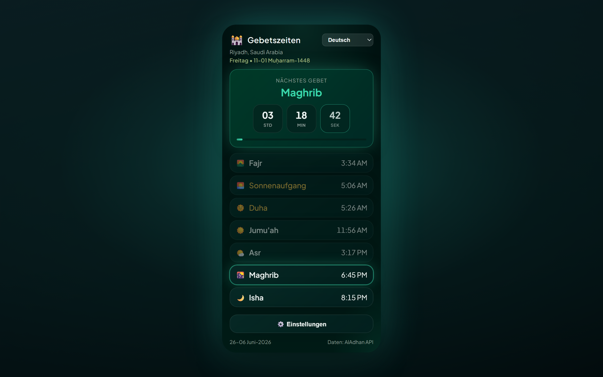

# Prayer Times Reminder — Chrome Extension (Deutsch)

> **Gebetszeiten-Pause** — Wenn die Gebetszeit kommt, werden Ihre offenen Tabs gesperrt, damit Sie innehalten und beten können.

Eine Chrome-Erweiterung (Manifest V3), die:

- 🔔 **Benachrichtigt Sie zu jeder Gebetszeit** (Fajr, Dhuhr, Asr, Maghrib, Isha) — in der von Ihnen gewählten Sprache.
- 🔒 **Optionale Tab-Sperre** — wenn die Gebetszeit erreicht ist, blockiert ALLE geöffneten Browser-Tabs für eine einstellbare Dauer (1–120 Minuten, Standard 5) mit einem Countdown-Overlay; Tabs, die Sie während der Sperre öffnen oder zu denen Sie navigieren, werden ebenfalls erfasst; optional manuelles Entsperren über die Schließen-Schaltfläche.
- 🕌 **Den vollständigen täglichen Gebetsplan** für Ihre Stadt/Ihr Land anzeigt, mit einem Live-Countdown zum nächsten Gebet.
- 🌍 **Länder- und Stadt-Dropdowns** — wählen Sie ein Land, die Städteliste wird automatisch geladen.
- 🌐 **8 Sprachen** — wechseln Sie über den Popup-Header oder **Settings → Language** (siehe [Unterstützte Sprachen](#unterstützte-sprachen)).
- 🌗 **Design** — Midnight Emerald (Standard) oder Classic — in den Einstellungen wählbar.
- 📅 **Datumsformat** — wählen Sie, wie das Hidschri- und das gregorianische Datum angezeigt werden.
- 🌙 **Hidschri-Datum** wird neben dem gregorianischen Datum angezeigt.
- 📿 **Periodischer Dhikr** — optionaler schwebender Hinweis mit 139 einzigartigen Formulierungen auf dem aktiven Tab; antippen zum Schließen oder automatisches Ausblenden nach 10 Sekunden.

[English](README.en.md) · [Deutsch](README.de.md) · [العربية](README.ar.md) · [اردو](README.ur.md) · [Français](README.fr.md) · [Español](README.es.md) · [हिन्दी](README.hi.md) · [Bahasa Indonesia](README.id.md)

Gebetszeiten stammen von der kostenlosen [AlAdhan API](https://aladhan.com/prayer-times-api); die Städteliste von der kostenlosen [CountriesNow API](https://countriesnow.space). Keine API-Schlüssel erforderlich.

## Installation

**Aus dem Chrome Web Store installieren (empfohlen):** [Zu Chrome hinzufügen](https://chromewebstore.google.com/detail/prayer-times-reminder/knahkbkmbjghaiillhngjbhoinmeegoc)

Oder zur Entwicklung als entpackte Erweiterung laden:

1. Öffnen Sie `chrome://extensions` in Chrome.
2. Aktivieren Sie **Developer mode** (oben rechts).
3. Klicken Sie auf **Load unpacked** und wählen Sie diesen Ordner.
4. Klicken Sie auf das Erweiterungssymbol in der Symbolleiste, um das Popup zu öffnen.
5. Klicken Sie auf **⚙️ Settings**, wählen Sie **Country** und dann **City** aus den Dropdowns (oder klicken Sie **📍 Use my location**), wählen Sie eine Berechnungsmethode, dann **Save & Load**.
6. Wählen Sie Ihre Sprache im Dropdown im Popup-Header (oder unter **Settings → Language**).

Bei der Erstinstallation öffnet sich ein Willkommens-Tab mit Schritten zum **Anheften der Erweiterung** an die Chrome-Symbolleiste (Chrome erlaubt Erweiterungen nicht, sich selbst anzuheften).

Das war's — die Erweiterung lädt die heutigen Zeiten, zeigt sie an und plant eine Benachrichtigung für jedes bevorstehende Gebet. Nach Mitternacht wird automatisch für den neuen Tag aktualisiert.

> **Benachrichtigungen:** Stellen Sie sicher, dass Chrome in den OS-Einstellungen Systembenachrichtigungen anzeigen darf, sonst erscheinen die Hinweise nicht.

## Einstellungen

| Setting | Description |
|---------|-------------|
| Country / City | Standort für Gebetszeiten (oder Geolokalisierung nutzen). |
| Calculation method | AlAdhan-Methode (ISNA, Muslim World League, Umm al-Qura, Egyptian, Karachi, Diyanet, usw.). |
| Date format | Wie das Hidschri- und das gregorianische Datum erscheinen. |
| Number style | Wenn Arabisch oder Urdu aktiv: Arabic-Indic (٠١٢٣) oder westliche (0123) Ziffern. |
| Lock tab during prayer | Legt bei Gebetszeit ein Vollbild-Overlay auf alle geöffneten Tabs. |
| Lock duration | Wie lange der Tab gesperrt bleibt (1–120 Minuten). |
| Allow manual unlock | Zeigt eine Schließen-Schaltfläche (×) zum frühen Beenden der Sperre. |
| Test tab lock | Vorschau des Sperr-Overlays auf dem aktuellen Tab (funktioniert auf normalen Websites, nicht auf `chrome://`-Seiten). |
| Periodic dhikr | Zeigt einen zufälligen Dhikr auf dem aktiven Tab in festem oder zufälligem Intervall (1–120 Minuten). |
| Dhikr position | Ecke oder Mitte der Seite (oben/unten × links/rechts/Mitte). |
| Test dhikr | Vorschau der Dhikr-Karte auf dem aktuellen Tab. |
| Theme | **Midnight Emerald** (Standard) oder **Classic** wählen. |
| Language | UI-Sprache wählen (auch im Popup-Header verfügbar). |

## Unterstützte Sprachen

UI, Benachrichtigungen, Sperr-Overlay, Dhikr-Karte und Willkommensseite sind lokalisiert. Sprache wechseln über das Dropdown im Popup-Header oder **Settings → Language**.

| Code | Language | Direction | Notes |
|------|----------|-----------|-------|
| `en` | English | LTR | Standard-Fallback bei fehlenden Texten |
| `de` | Deutsch (German) | LTR | |
| `ar` | العربية (Arabic) | RTL | Standard bei Erstinstallation; optionale Arabic-Indic-Ziffern (٠١٢٣) |
| `ur` | اردو (Urdu) | RTL | Optionale Arabic-Indic-Ziffern (٠١٢٣) |
| `hi` | हिन्दी (Hindi) | LTR | |
| `id` | Bahasa Indonesia | LTR | |
| `fr` | Français (French) | LTR | |
| `es` | Español (Spanish) | LTR | |

Übersetzungen befinden sich in `i18n.js` (`I18N` + `SUPPORTED_LANGS`). Dhikr-Formulierungen in `tasbih-phrases.js` enthalten Arabisch mit sprachspezifischen Bezeichnungen, wo verfügbar.

## Dateien

| File | Purpose |
|------|---------|
| `manifest.json` | MV3-Manifest (Berechtigungen: alarms, notifications, storage, geolocation, tabs, scripting). |
| `background.js` | Service Worker — lädt Zeiten, plant `chrome.alarms`, sendet lokalisierte Benachrichtigungen, sperrt alle geöffneten Tabs zur Gebetszeit. |
| `content-lock.js` | Injected Overlay (Shadow DOM), das Seiteninteraktion blockiert, bis der Timer endet oder Sie manuell entsperren. |
| `content-tasbih.js` | Injected schwebende Dhikr-Karte; schließen per Tippen oder nach 10 Sekunden. |
| `tasbih-phrases.js` | 139 einzigartige Dhikr-Formulierungen. |
| `welcome.html` / `welcome.css` | Willkommensseite bei Erstinstallation mit Anheft-Anleitung (lokalisiert). |
| `i18n.js` | Gemeinsame Übersetzungen (EN/DE/AR/UR/HI/ID/FR/ES), Gebetsnamen, Länderliste, Berechnungsmethoden, Datumsformate, Ziffern-Helfer. |
| `popup.html` / `popup.css` / `popup.js` | Popup-Oberfläche (Plan, Countdown, Sprachauswahl, Einstellungen). |
| `theme.css` | Gemeinsame Midnight-Emerald-Design-Tokens und Utilities (Popup, Einstellungen, Willkommen). |
| `icons/` | Erweiterungssymbole (Halbmond + Stern). |
| `make_icons.py` | Erzeugt die PNG-Symbole neu (nur für Entwicklung, zur Laufzeit nicht nötig). |
| `PRIVACY.md` | Datenschutzrichtlinie der Erweiterung. |

## Funktionsweise

- **Planung:** Bei Installation/Start und bei Standortänderung lädt der Service Worker die heutigen Zeiten und erstellt einmalige `chrome.alarms`-Einträge zu jeder bevorstehenden Gebetszeit, plus einen Refresh-Alarm kurz nach Mitternacht.
- **Tab-Sperre:** Wenn in den Einstellungen aktiviert, injiziert die Erweiterung bei einem Gebetsalarm `content-lock.js` in jeden geöffneten Tab und zeigt ein Countdown-Overlay für die konfigurierte Dauer. Das Overlay blockiert Tastatur, Scrollen und Zeigereingaben. Tabs, die Sie während des Sperrzeitfensters öffnen oder zu denen Sie navigieren, werden ebenfalls automatisch gesperrt. Aktivieren Sie **Allow manual unlock** für eine Schließen-Schaltfläche (×). Nutzen Sie **Test tab lock** für eine Vorschau auf dem aktuellen Tab.
- **Dhikr-Erinnerung:** Wenn aktiviert, zeigt ein `chrome.alarms`-Timer in festem oder zufälligem Intervall (min/max) eine zufällige Formulierung aus `tasbih-phrases.js` auf dem aktiven Tab. Die Karte blockiert die Seite nicht; tippen zum Schließen oder 10 Sekunden warten.
- **Benachrichtigungen:** Wenn eine Gebetszeit erreicht ist, erscheint eine lokalisierte Systembenachrichtigung.
- **Popup:** Zeigt den gecachten Plan sofort und aktualisiert dann aus dem Netzwerk; das nächste Gebet wird mit sekündlichem Countdown hervorgehoben.

## Berechnungsmethoden

Das Einstellungs-Dropdown bietet gängige AlAdhan-Methoden (ISNA, Muslim World League, Umm al-Qura, Egyptian, Karachi, Diyanet, usw.). Wählen Sie die Methode Ihrer lokalen Moschee/Autorität für die genauesten Zeiten.

## Datenschutz

Siehe [PRIVACY.md](PRIVACY.md) für lokal gespeicherte Daten und kontaktierte Drittanbieter-APIs.

## Lizenz

MIT — siehe [LICENSE](LICENSE).

Um des Angesichts Allahs des Erhabenen willen, im Namen aller Muslime.

