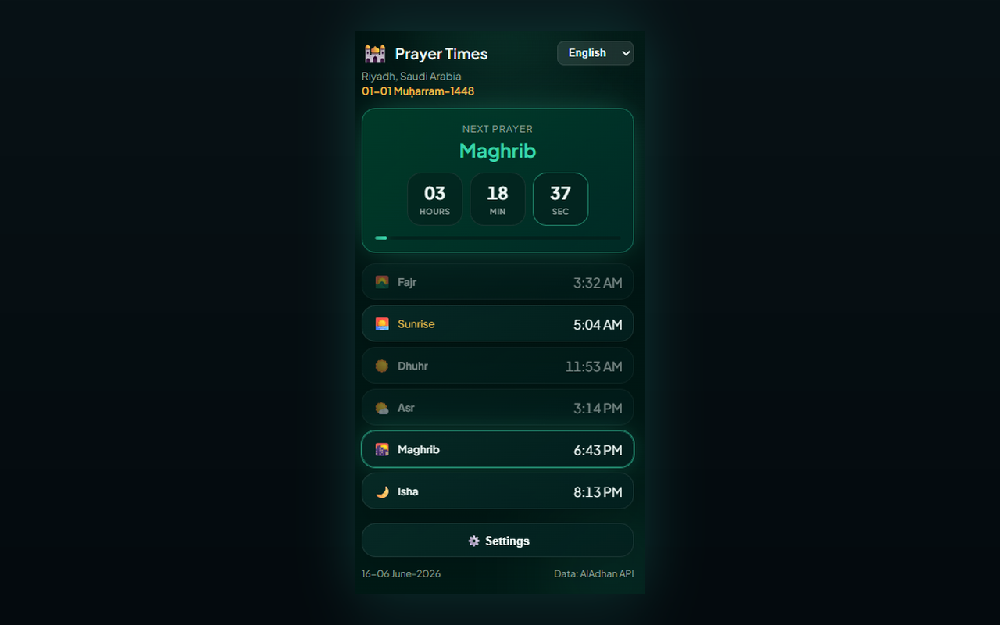

# Prayer Times Reminder — Chrome Extension (English)

A Manifest V3 Chrome extension that:

- 🔔 **Notifies you 5 minutes before each prayer** and again when the time arrives (Fajr, Dhuhr, Asr, Maghrib, Isha) — in your chosen language.
- 🔒 **Optional tab lock** — when prayer time arrives, blocks the active browser tab for a configurable duration (1–120 minutes, default 5) with a countdown overlay; optional manual unlock via close button.
- 🕌 **Shows the full daily prayer schedule** for your city/country, with a live countdown to the next prayer.
- 🌍 **Country & city dropdowns** — pick a country, and the city list loads automatically.
- 🌐 **8 languages** — switch from the popup header or **Settings → Language** (see [Supported languages](#supported-languages)).
- 🌗 **Theme** — Midnight Emerald (default) or Classic — selectable in Settings.
- 📅 **Gregorian date format** — choose how the footer date is displayed (e.g. `10-04-2026`, `10 April 2026`, long text).
- 🌙 **Hijri date** shown alongside the Gregorian date.
- 📿 **Periodic dhikr** — optional floating reminder with 100 unique phrases on the active tab; tap to dismiss or auto-hide after 10 seconds.

[English](README.en.md) · [Deutsch](README.de.md) · [العربية](README.ar.md) · [اردو](README.ur.md) · [Français](README.fr.md) · [Español](README.es.md) · [हिन्दी](README.hi.md) · [Bahasa Indonesia](README.id.md)

Prayer times come from the free [AlAdhan API](https://aladhan.com/prayer-times-api); the city list comes from the free [CountriesNow API](https://countriesnow.space). No API keys required.

## Install (load unpacked)

1. Open `chrome://extensions` in Chrome.
2. Toggle **Developer mode** on (top-right).
3. Click **Load unpacked** and select this folder.
4. Click the extension icon in the toolbar to open the popup.
5. Click **⚙️ Settings**, choose your **Country** then **City** from the dropdowns (or click **📍 Use my location**), pick a calculation method, then **Save & Load**.
6. Choose your language from the **dropdown** in the popup header (or in **Settings → Language**).

On first install, a welcome tab opens with steps to **pin the extension** to the Chrome toolbar (Chrome does not allow extensions to pin themselves automatically).

That's it — the extension will fetch today's times, show them, and schedule a notification for each upcoming prayer. It automatically refreshes after midnight for the new day.

> **Notifications:** make sure Chrome is allowed to show system notifications in your OS settings, otherwise the alerts won't appear.

## Settings

| Setting | Description |
|---------|-------------|
| Country / City | Location used for prayer times (or use geolocation). |
| Calculation method | AlAdhan method (ISNA, Muslim World League, Umm al-Qura, Egyptian, Karachi, Diyanet, etc.). |
| Date format | How the Gregorian date appears in the footer. |
| Number style | When Arabic or Urdu is active: Arabic-Indic (٠١٢٣) or Western (0123) digits for times and countdowns. |
| Lock tab during prayer | Injects a full-page overlay on the active tab at prayer time. |
| Lock duration | How long the tab stays locked (1–120 minutes). |
| Allow manual unlock | Shows a close (×) button to dismiss the lock screen early. |
| Test tab lock | Preview the lock overlay on the current tab (works on normal websites, not `chrome://` pages). |
| Periodic dhikr | Shows a random dhikr on the active tab at a fixed or random interval (1–120 minutes). |
| Dhikr position | Corner or center of the page (top/bottom × left/right/center). |
| Test dhikr | Preview the dhikr card on the current tab. |
| Theme | Choose **Midnight Emerald** (default) or **Classic**. |
| Language | Choose the UI language (also available in the popup header). |

## Supported languages

The UI, notifications, lock overlay, dhikr card, and welcome page are localized. Change language from the popup header dropdown or **Settings → Language**.

| Code | Language | Direction | Notes |
|------|----------|-----------|-------|
| `en` | English | LTR | Default fallback if a string is missing |
| `de` | Deutsch (German) | LTR | |
| `ar` | العربية (Arabic) | RTL | Default on first install; optional Arabic-Indic numerals (٠١٢٣) |
| `ur` | اردو (Urdu) | RTL | Optional Arabic-Indic numerals (٠١٢٣) |
| `hi` | हिन्दी (Hindi) | LTR | |
| `id` | Bahasa Indonesia | LTR | |
| `fr` | Français (French) | LTR | |
| `es` | Español (Spanish) | LTR | |

Translations live in `i18n.js` (`I18N` + `SUPPORTED_LANGS`). Dhikr phrases in `tasbih-phrases.js` include Arabic with per-language labels where available.

## Files

| File | Purpose |
|------|---------|
| `manifest.json` | MV3 manifest (permissions: alarms, notifications, storage, geolocation, tabs, scripting). |
| `background.js` | Service worker — fetches times, schedules `chrome.alarms`, fires localized notifications, locks active tab at prayer time. |
| `content-lock.js` | Injected overlay (shadow DOM) that blocks page interaction until the timer ends or the user unlocks manually. |
| `content-tasbih.js` | Injected floating dhikr card; dismiss on tap or after 10 seconds. |
| `tasbih-phrases.js` | 100 unique dhikr phrases (Arabic + English transliteration). |
| `welcome.html` / `welcome.css` | First-install welcome page with pin-to-toolbar instructions (localized). |
| `i18n.js` | Shared translations (EN/DE/AR/UR/HI/ID/FR/ES), prayer names, country list, calculation methods, date formats, digit helper. |
| `popup.html` / `popup.css` / `popup.js` | The popup UI (schedule, countdown, language selector, settings). |
| `icons/` | Extension icons (crescent + star). |
| `make_icons.py` | Regenerates the PNG icons (dev-only, not needed at runtime). |
| `PRIVACY.md` | Privacy policy for the extension. |

## How it works

- **Scheduling:** on install/startup and whenever your location changes, the service worker fetches today's timings and creates one-shot `chrome.alarms` entries 5 minutes before each upcoming prayer and at the prayer time itself, plus a refresh alarm just after midnight.
- **Tab lock:** if enabled in settings, when a prayer alarm fires the extension injects `content-lock.js` into the active tab and shows a countdown overlay for the configured duration. The overlay blocks keyboard, scroll, and pointer input on the page. Enable **Allow manual unlock** to show a close (×) button. Use **Test tab lock** in settings to preview it on the current tab.
- **Dhikr reminder:** if enabled, a `chrome.alarms` timer shows a random phrase from `tasbih-phrases.js` on the active tab at a fixed interval or a random interval within your min/max range. The card does not block the page; click it to dismiss or wait 10 seconds.
- **Notifications:** when a reminder or prayer alarm fires, a system notification appears (`requireInteraction` so it stays until dismissed).
- **Popup:** renders the cached schedule instantly, then refreshes from the network; the next prayer is highlighted with a second-by-second countdown.

## Calculation methods

The settings dropdown exposes common AlAdhan methods (ISNA, Muslim World League, Umm al-Qura, Egyptian, Karachi, Diyanet, etc.). Pick whichever matches your local mosque/authority for the most accurate times.

## Privacy

See [PRIVACY.md](PRIVACY.md) for what data is stored locally and which third-party APIs are contacted.

## License

MIT — see [LICENSE](LICENSE).
