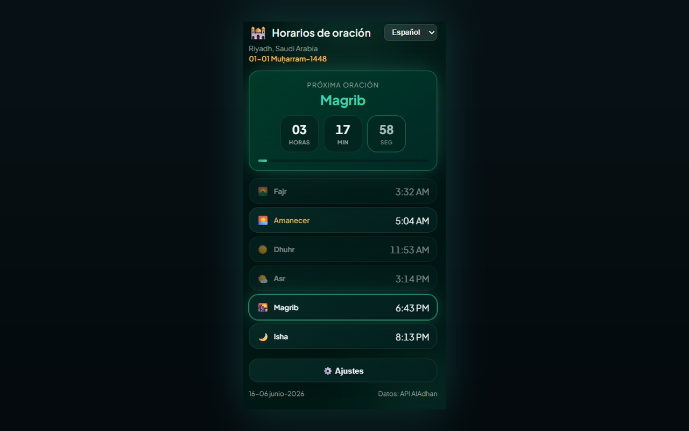

# Prayer Times Reminder — Chrome Extension (Español)

> **Pausa de horarios de oración** — cuando llega la hora de la oración, tus pestañas abiertas se bloquean para que puedas apartarte y orar.

Una extensión de Chrome (Manifest V3) que:

- 🔔 **Te notifica a la hora de cada oración** (Fajr, Dhuhr, Asr, Maghrib, Isha) — en el idioma que hayas elegido.
- 🔒 **Bloqueo opcional de pestañas** — cuando llega la hora, bloquea TODAS las pestañas abiertas del navegador durante una duración configurable (1–120 minutos, por defecto 5) con una cuenta atrás; las pestañas que abras o a las que navegues durante el bloqueo también quedan cubiertas; opción de desbloqueo manual mediante el botón de cerrar.
- 🕌 **Muestra el horario diario completo** para tu ciudad/país, con una cuenta atrás en tiempo real hacia la siguiente oración.
- 🌍 **Menús desplegables de país y ciudad** — elige un país y la lista de ciudades se cargará automáticamente.
- 🌐 **8 idiomas** — cambia desde el encabezado del popup o **Settings → Language** (ver [Supported languages](#supported-languages)).
- 🌗 **Tema** — Midnight Emerald (por defecto) o Classic — seleccionable en Configuración.
- 📅 **Formato de fecha** — elige cómo se muestran las fechas Hijri y gregoriana (por ejemplo `10-04-2026`, `10 April 2026`, texto largo).
- 🌙 **Fecha Hijri** mostrada junto con la fecha gregoriana.
- 📿 **Dhikr periódico** — recordatorio flotante opcional con 139 frases únicas en la pestaña activa; tócalo para cerrar o se ocultará automáticamente después de 10 segundos.

[English](README.en.md) · [Deutsch](README.de.md) · [العربية](README.ar.md) · [اردو](README.ur.md) · [Français](README.fr.md) · [Español](README.es.md) · [हिन्दी](README.hi.md) · [Bahasa Indonesia](README.id.md)

Los horarios de oración provienen de la API gratuita [AlAdhan API](https://aladhan.com/prayer-times-api); la lista de ciudades proviene de la API gratuita [CountriesNow API](https://countriesnow.space). No se requieren claves API.

## Instalación

**Instalar desde la Chrome Web Store (recomendado):** [Añadir a Chrome](https://chromewebstore.google.com/detail/prayer-times-reminder/knahkbkmbjghaiillhngjbhoinmeegoc)

O cárgala sin empaquetar para desarrollo:

1. Abre `chrome://extensions` en Chrome.
2. Activa **Developer mode** (arriba a la derecha).
3. Haz clic en **Load unpacked** y selecciona esta carpeta.
4. Haz clic en el icono de la extensión en la barra de herramientas para abrir el popup.
5. Haz clic en **⚙️ Settings**, elige tu **Country** y luego **City** en los desplegables (o haz clic en **📍 Use my location**), elige un método de cálculo y luego **Save & Load**.
6. Elige tu idioma desde el desplegable del encabezado del popup (o en **Settings → Language**).

Al instalar por primera vez, se abre una pestaña de bienvenida con pasos para **fijar la extensión** en la barra de herramientas de Chrome (Chrome no permite que las extensiones se fijen automáticamente).

Listo — la extensión obtendrá los horarios de hoy, los mostrará y programará una notificación para cada oración próxima. Se actualiza automáticamente después de medianoche para el día nuevo.

> **Notificaciones:** asegúrate de que Chrome tenga permiso para mostrar notificaciones del sistema en la configuración de tu sistema operativo; de lo contrario, no aparecerán las alertas.

## Configuración

| Setting | Description |
|---------|-------------|
| Country / City | Ubicación usada para los horarios de oración (o usa geolocalización). |
| Calculation method | Método AlAdhan (ISNA, Muslim World League, Umm al-Qura, Egyptian, Karachi, Diyanet, etc.). |
| Date format | Cómo aparecen las fechas Hijri y gregoriana. |
| Number style | Cuando están activos árabe o urdu: dígitos Arabic-Indic (٠١٢٣) o Western (0123) para horarios y cuenta atrás. |
| Lock tab during prayer | Inyecta una capa de página completa en todas las pestañas abiertas en la hora de la oración. |
| Lock duration | Cuánto tiempo permanece bloqueada la pestaña (1–120 minutos). |
| Allow manual unlock | Muestra un botón de cerrar (×) para descartar la pantalla de bloqueo antes. |
| Test tab lock | Vista previa de la capa de bloqueo en la pestaña actual (funciona en sitios normales, no en páginas `chrome://`). |
| Periodic dhikr | Muestra un dhikr aleatorio en la pestaña activa a un intervalo fijo o aleatorio (1–120 minutos). |
| Dhikr position | Esquina o centro de la página (arriba/abajo × izquierda/derecha/centro). |
| Test dhikr | Vista previa de la tarjeta de dhikr en la pestaña actual. |
| Theme | Elige **Midnight Emerald** (por defecto) o **Classic**. |
| Language | Elige el idioma de la interfaz (también disponible en el encabezado del popup). |

## Idiomas admitidos

La interfaz de usuario, las notificaciones, la capa de bloqueo, la tarjeta de dhikr y la página de bienvenida están localizadas. Cambia el idioma desde el desplegable del encabezado del popup o **Settings → Language**.

| Code | Language | Direction | Notes |
|------|----------|-----------|-------|
| `en` | English | LTR | Reemplazo por defecto si falta una cadena |
| `de` | Deutsch (German) | LTR | |
| `ar` | العربية (Arabic) | RTL | Predeterminado en la primera instalación; numerales Arabic-Indic opcionales (٠١٢٣) |
| `ur` | اردو (Urdu) | RTL | Numerales Arabic-Indic opcionales (٠١٢٣) |
| `hi` | हिन्दी (Hindi) | LTR | |
| `id` | Bahasa Indonesia | LTR | |
| `fr` | Français (French) | LTR | |
| `es` | Español (Spanish) | LTR | |

Las traducciones viven en `i18n.js` (`I18N` + `SUPPORTED_LANGS`). Las frases de dhikr en `tasbih-phrases.js` incluyen árabe con etiquetas por idioma cuando están disponibles.

## Archivos

| File | Purpose |
|------|---------|
| `manifest.json` | Manifest MV3 (permissions: alarms, notifications, storage, geolocation, tabs, scripting). |
| `background.js` | Service worker — obtiene los horarios, agenda `chrome.alarms`, muestra notificaciones localizadas y bloquea todas las pestañas abiertas en la hora de oración. |
| `content-lock.js` | Capa inyectada (shadow DOM) que bloquea la interacción con la página hasta que termine el temporizador o el usuario desbloquee manualmente. |
| `content-tasbih.js` | Tarjeta flotante de dhikr inyectada; se descarta al tocarla o después de 10 segundos. |
| `tasbih-phrases.js` | 139 frases únicas de dhikr. |
| `welcome.html` / `welcome.css` | Página de bienvenida al instalar (instrucciones para fijar en la barra) (localizada). |
| `i18n.js` | Traducciones compartidas (EN/DE/AR/UR/HI/ID/FR/ES), nombres de oraciones, lista de países, métodos de cálculo, formatos de fecha y ayuda de dígitos. |
| `popup.html` / `popup.css` / `popup.js` | UI del popup (horarios, cuenta atrás, selector de idioma y configuración). |
| `icons/` | Iconos de la extensión (luna creciente + estrella). |
| `make_icons.py` | Regenera los iconos PNG (solo dev; no es necesario en runtime). |
| `PRIVACY.md` | Política de privacidad de la extensión. |

## Cómo funciona

- **Programación:** en instalación/inicio y cada vez que cambia tu ubicación, el service worker obtiene los horarios del día y crea entradas one-shot de `chrome.alarms` en el momento exacto de cada oración próxima, además de un alarm de actualización justo después de medianoche.
- **Bloqueo de pestañas:** si está activado en Configuración, cuando suena una alarma de oración la extensión inyecta `content-lock.js` en todas las pestañas abiertas y muestra una cuenta atrás durante la duración configurada. Las pestañas que abras o a las que navegues durante el periodo de bloqueo también se bloquean automáticamente. La capa bloquea teclado, desplazamiento y la entrada del puntero. Activa **Allow manual unlock** para mostrar el botón de cerrar (×). Usa **Test tab lock** en Configuración para previsualizar en la pestaña actual.
- **Recordatorio de dhikr:** si está activado, un temporizador `chrome.alarms` muestra una frase aleatoria de `tasbih-phrases.js` en la pestaña activa en un intervalo fijo o aleatorio dentro del rango min/max. La tarjeta no bloquea la página; haz clic para descartar o espera 10 segundos.
- **Notificaciones:** cuando llega la hora de una oración, aparece una notificación del sistema localizada.
- **Popup:** renderiza el horario en caché al instante y luego se refresca desde la red; la siguiente oración se resalta con una cuenta atrás segundo a segundo.

## Métodos de cálculo

El menú desplegable de Configuración muestra métodos comunes de AlAdhan (ISNA, Muslim World League, Umm al-Qura, Egyptian, Karachi, Diyanet, etc.). Elige el que mejor coincida con tu mezquita/autoridad para obtener los horarios más precisos.

## Privacidad

Consulta [PRIVACY.md](PRIVACY.md) para saber qué datos se almacenan localmente y a qué APIs de terceros se accede.

## Licencia

MIT — ver [LICENSE](LICENSE).

Por la faz de Allah el Altísimo, en nombre de todos los musulmanes.

