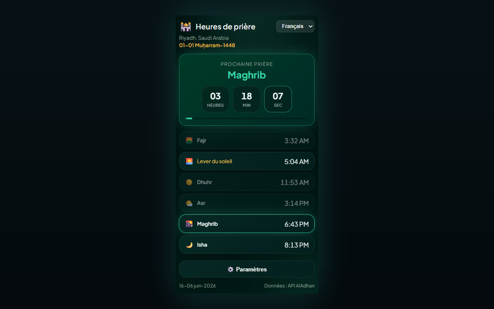

# Prayer Times Reminder — Chrome Extension (Français)

Une extension Chrome (Manifest V3) qui :

- 🔔 **Vous notifie 5 minutes avant chaque prière**, puis à l’arrivée du moment (Fajr, Dhuhr, Asr, Maghrib, Isha) — dans la langue que vous choisissez.
- 🔒 **Verrouillage optionnel de l’onglet** — à l’heure de la prière, bloque l’onglet de navigateur actif pendant une durée configurable (1–120 minutes, par défaut 5) avec un compte à rebours ; option de déverrouillage manuel via le bouton de fermeture.
- 🕌 **Affiche le programme complet des prières** pour votre ville/pays, avec un compte à rebours en temps réel vers la prochaine prière.
- 🌍 **Sélecteurs pays & ville** — choisissez un pays, et la liste des villes se charge automatiquement.
- 🌐 **8 langues** — basculez depuis le menu du popup ou **Settings → Language** (voir [Supported languages](#supported-languages)).
- 🌗 **Thème** — Midnight Emerald (par défaut) ou Classic — sélectionnable dans les paramètres.
- 📅 **Format de la date grégorienne** — choisissez comment la date du pied de page est affichée (par ex. `10-04-2026`, `10 April 2026`, texte long).
- 🌙 **Date Hijri** affichée à côté de la date grégorienne.
- 📿 **Dhikr périodique** — rappel flottant optionnel avec 100 phrases uniques sur l’onglet actif ; cliquez pour fermer ou masquez automatiquement après 10 secondes.

[English](README.en.md) · [Deutsch](README.de.md) · [العربية](README.ar.md) · [اردو](README.ur.md) · [Français](README.fr.md) · [Español](README.es.md) · [हिन्दी](README.hi.md) · [Bahasa Indonesia](README.id.md)

Les heures de prière proviennent de l’API gratuite [AlAdhan API](https://aladhan.com/prayer-times-api) ; la liste des villes provient de l’API gratuite [CountriesNow API](https://countriesnow.space). Aucune clé API requise.

## Installation (load unpacked)

1. Ouvrez `chrome://extensions` dans Chrome.
2. Activez **Developer mode** (en haut à droite).
3. Cliquez sur **Load unpacked** et sélectionnez ce dossier.
4. Cliquez sur l’icône de l’extension dans la barre d’outils pour ouvrir le popup.
5. Cliquez sur **⚙️ Settings**, choisissez **Country** puis **City** dans les menus déroulants (ou cliquez **📍 Use my location**), choisissez une méthode de calcul, puis **Save & Load**.
6. Choisissez votre langue dans le menu déroulant du popup (ou dans **Settings → Language**).

Lors de la première installation, un onglet de bienvenue s’ouvre avec des étapes pour **épingler l’extension** à la barre d’outils de Chrome (Chrome ne permet pas aux extensions de s’épingler automatiquement).

C’est tout — l’extension récupère les horaires d’aujourd’hui, les affiche, et planifie une notification pour chaque prière à venir. Elle se rafraîchit automatiquement après minuit pour le nouveau jour.

> **Notifications :** assurez-vous que Chrome est autorisé à afficher les notifications système dans les paramètres de votre OS, sinon les alertes n’apparaîtront pas.

## Paramètres

| Setting | Description |
|---------|-------------|
| Country / City | Lieu utilisé pour les heures de prière (ou utilisez la géolocalisation). |
| Calculation method | Méthode AlAdhan (ISNA, Muslim World League, Umm al-Qura, Egyptian, Karachi, Diyanet, etc.). |
| Date format | Comment la date grégorienne apparaît dans le pied de page. |
| Number style | Quand l’arabe ou l’ourdou est actif : chiffres Arabic-Indic (٠١٢٣) ou occidentaux (0123) pour les horaires et le compte à rebours. |
| Lock tab during prayer | Injecte un overlay plein écran sur l’onglet actif à l’heure de prière. |
| Lock duration | Durée pendant laquelle l’onglet reste verrouillé (1–120 minutes). |
| Allow manual unlock | Affiche un bouton de fermeture (×) pour masquer l’écran de verrouillage plus tôt. |
| Test tab lock | Aperçu de l’overlay de verrouillage sur l’onglet actuel (fonctionne sur des sites normaux, pas sur les pages `chrome://`). |
| Periodic dhikr | Affiche un dhikr aléatoire sur l’onglet actif à intervalle fixe ou aléatoire (1–120 minutes). |
| Dhikr position | Coin ou centre de la page (haut/bas × gauche/droite/centre). |
| Test dhikr | Aperçu de la carte dhikr sur l’onglet actuel. |
| Theme | Choisissez **Midnight Emerald** (par défaut) ou **Classic**. |
| Language | Choisissez la langue de l’interface (disponible aussi dans le popup). |

## Langues prises en charge

L’interface, les notifications, l’overlay de verrouillage, la carte dhikr et la page de bienvenue sont localisés. Changez de langue depuis le menu du popup ou **Settings → Language**.

| Code | Language | Direction | Notes |
|------|----------|-----------|-------|
| `en` | English | LTR | Repli par défaut si une chaîne manque |
| `de` | Deutsch (German) | LTR | |
| `ar` | العربية (Arabic) | RTL | Par défaut à la première installation ; chiffres Arabic-Indic en option (٠١٢٣) |
| `ur` | اردو (Urdu) | RTL | Chiffres Arabic-Indic en option (٠١٢٣) |
| `hi` | हिन्दी (Hindi) | LTR | |
| `id` | Bahasa Indonesia | LTR | |
| `fr` | Français (French) | LTR | |
| `es` | Español (Spanish) | LTR | |

Les traductions vivent dans `i18n.js` (`I18N` + `SUPPORTED_LANGS`). Les phrases de dhikr dans `tasbih-phrases.js` incluent l’arabe avec des libellés selon la langue, quand disponibles.

## Fichiers

| File | Purpose |
|------|---------|
| `manifest.json` | Manifest MV3 (permissions : alarms, notifications, storage, geolocation, tabs, scripting). |
| `background.js` | Service worker — récupère les horaires, planifie `chrome.alarms`, envoie des notifications localisées, et verrouille l’onglet actif à l’heure de prière. |
| `content-lock.js` | Overlay injecté (shadow DOM) qui bloque l’interaction de la page jusqu’à la fin du minuteur ou le déverrouillage manuel. |
| `content-tasbih.js` | Carte dhikr flottante injectée ; disparaît au clic ou après 10 secondes. |
| `tasbih-phrases.js` | 100 phrases dhikr uniques (arabe + translittération anglaise). |
| `welcome.html` / `welcome.css` | Page de bienvenue lors de la première installation avec instructions d’épinglage (localisées). |
| `i18n.js` | Traductions partagées (EN/DE/AR/UR/HI/ID/FR/ES), noms des prières, liste des pays, méthodes de calcul, formats de date, aide pour les chiffres. |
| `popup.html` / `popup.css` / `popup.js` | L’interface du popup (programme, compte à rebours, sélecteur de langue, paramètres). |
| `icons/` | Icônes de l’extension (croissant + étoile). |
| `make_icons.py` | Reconstruit les icônes PNG (dev-only, pas nécessaire à l’exécution). |
| `PRIVACY.md` | Politique de confidentialité pour l’extension. |

## Fonctionnement

- **Planification :** à l’installation/démarrage et à chaque changement de localisation, le service worker récupère les horaires du jour et crée des entrées `chrome.alarms` one-shot 5 minutes avant chaque prière à venir et à l’heure exacte, plus une alarme de rafraîchissement juste après minuit.
- **Verrouillage de l’onglet :** si activé dans les paramètres, quand une alarme de prière se déclenche l’extension injecte `content-lock.js` dans l’onglet actif et affiche un compte à rebours pour la durée configurée. L’overlay bloque le clavier, le défilement et l’entrée du pointeur. Activez **Allow manual unlock** pour afficher un bouton de fermeture (×). Utilisez **Test tab lock** pour prévisualiser sur l’onglet actuel.
- **Rappel dhikr :** si activé, un minuteur `chrome.alarms` affiche une phrase aléatoire de `tasbih-phrases.js` sur l’onglet actif à intervalle fixe ou aléatoire dans votre plage min/max. La carte ne bloque pas la page : cliquez dessus pour fermer ou attendez 10 secondes.
- **Notifications :** lorsque le rappel ou une alarme de prière se déclenche, une notification système apparaît (`requireInteraction` pour qu’elle reste jusqu’à fermeture).
- **Popup :** rend instantanément le programme mis en cache, puis se rafraîchit depuis le réseau ; la prochaine prière est mise en avant avec un compte à rebours seconde par seconde.

## Méthodes de calcul

Le menu déroulant des paramètres propose des méthodes courantes d’AlAdhan (ISNA, Muslim World League, Umm al-Qura, Egyptian, Karachi, Diyanet, etc.). Choisissez celle qui correspond le mieux à votre mosquée/autorité pour les heures les plus exactes.

## Confidentialité

Voir [PRIVACY.md](PRIVACY.md) pour savoir quelles données sont stockées localement et quelles API tierces sont contactées.

## Licence

MIT — voir [LICENSE](LICENSE).

