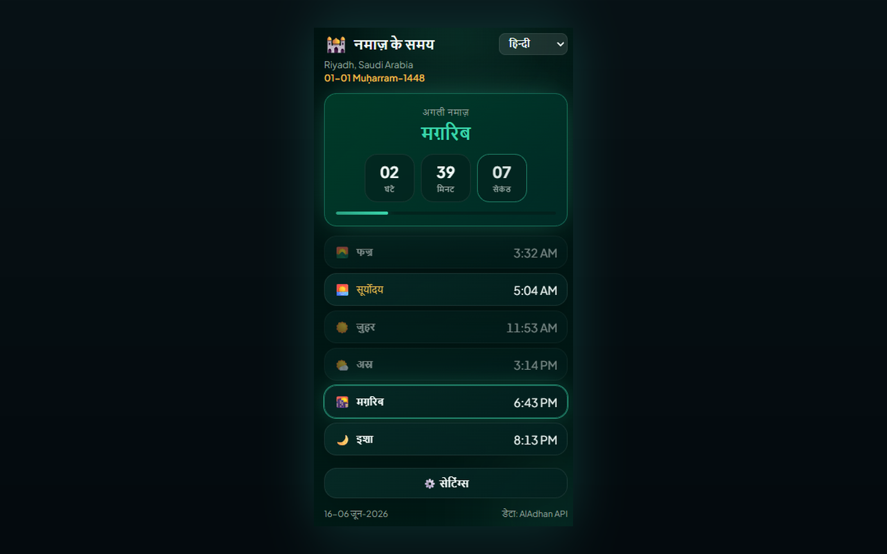

# Prayer Times Reminder — Chrome Extension (हिन्दी)

> **नमाज़ के समय का विराम** — नमाज़ का समय आने पर आपके खुले टैब लॉक हो जाते हैं ताकि आप स्क्रीन से हटकर नमाज़ पढ़ सकें।

A Manifest V3 Chrome extension that:

- 🔔 **हर नमाज़ के समय** (Fajr, Dhuhr, Asr, Maghrib, Isha) — आपकी चुनी हुई भाषा में नोटिफाई करता है।
- 🔒 **ऐच्छिक टैब लॉक** — समय आने पर सभी खुले ब्राउज़र टैब्स को (1–120 मिनट, डिफ़ॉल्ट 5) तक लॉक करता है, काउंटडाउन ओवरले के साथ; लॉक के दौरान आप जो टैब खोलते या नेविगेट करते हैं वे भी अपने-आप लॉक हो जाते हैं; जल्दी अनलॉक के लिए क्लोज़ बटन भी उपलब्ध।
- 🕌 **आपके शहर/देश के लिए पूरा दैनिक नमाज़ शेड्यूल** — अगली नमाज़ तक लाइव काउंटडाउन के साथ।
- 🌍 **Country & city dropdowns** — देश चुनें, फिर शहर की लिस्ट अपने-आप लोड हो जाएगी।
- 🌐 **8 भाषाएँ** — popup हेडर से या **Settings → Language** से स्विच करें (नीचे [Supported languages](#supported-languages))।
- 🌗 **Theme** — Midnight Emerald (डिफ़ॉल्ट) या Classic — Settings में चुनें।
- 📅 **Date format** — Hijri और Gregorian दोनों तारीख़ें कैसे दिखेंगी चुनें।
- 🌙 **Hijri date** — Gregorian तारीख़ के साथ दिखती है।
- 📿 **Periodic dhikr** — सक्रिय टैब पर एक रैंडम धिक्र (139 वाक्य) फ़्लोट करता है; टैप करके बंद करें या 10 सेकंड बाद अपने-आप छिप जाएगा।

[English](README.en.md) · [Deutsch](README.de.md) · [العربية](README.ar.md) · [اردو](README.ur.md) · [Français](README.fr.md) · [Español](README.es.md) · [हिन्दी](README.hi.md) · [Bahasa Indonesia](README.id.md)

Prayer times come from the free [AlAdhan API](https://aladhan.com/prayer-times-api); the city list comes from the free [CountriesNow API](https://countriesnow.space). No API keys required.

## Install

**Chrome Web Store से इंस्टॉल करें (अनुशंसित):** [Chrome में जोड़ें](https://chromewebstore.google.com/detail/prayer-times-reminder/knahkbkmbjghaiillhngjbhoinmeegoc)

या डेवलपमेंट के लिए इसे अनपैक्ड लोड करें:

1. Open `chrome://extensions` in Chrome.
2. Toggle **Developer mode** on (top-right).
3. Click **Load unpacked** and select this folder.
4. Click the extension icon in the toolbar to open the popup.
5. Click **⚙️ Settings**, choose your **Country** then **City** from the dropdowns (or click **📍 Use my location**), pick a calculation method, then **Save & Load**.
6. Choose your language from the **dropdown** in the popup header (or in **Settings → Language**).

पहली बार इंस्टॉल पर एक welcome tab खुलता है जिसमें Chrome toolbar पर **extension pin करने** के चरण होते हैं (Chrome extensions को खुद pin नहीं करने देता)।

बस — extension आज के समय लाएगा, दिखाएगा, और हर आने वाली नमाज़ के लिए notification शेड्यूल करेगा। आधी रात के बाद नए दिन के लिए अपने-आप refresh होता है।

> **Notifications:** सुनिश्चित करें कि OS settings में Chrome को system notifications दिखाने की अनुमति है, वरना alerts नहीं दिखेंगे।

## Settings

| Setting | Description |
|---------|-------------|
| Country / City | Location used for prayer times (or use geolocation). |
| Calculation method | AlAdhan method (ISNA, Muslim World League, Umm al-Qura, Egyptian, Karachi, Diyanet, etc.). |
| Date format | Hijri और Gregorian दोनों तारीख़ें कैसे दिखती हैं। |
| Number style | When Arabic or Urdu is active: Arabic-Indic (٠١٢٣) or Western (0123) digits for times and countdowns. |
| Lock tab during prayer | सभी खुले tabs पर prayer time के समय full-page overlay inject करता है। |
| Lock duration | Tab कितनी देर locked रहता है (1–120 minutes). |
| Allow manual unlock | Lock screen early dismiss करने के लिए close (×) बटन दिखाता है। |
| Test tab lock | Current tab पर lock overlay preview (normal websites पर काम करता है, `chrome://` pages पर नहीं)। |
| Periodic dhikr | Active tab पर fixed या random interval (1–120 minutes) पर dhikr दिखाता है। |
| Dhikr position | Page का corner या center (top/bottom × left/right/center). |
| Test dhikr | Current tab पर dhikr card preview। |
| Theme | Midnight Emerald (default) या Classic. |
| Language | UI language (popup header में भी)। |

## Supported languages

The UI, notifications, lock overlay, dhikr card, and welcome page are localized. Change language from the popup header dropdown or **Settings → Language**.

| Code | Language | Direction | Notes |
|------|----------|-----------|-------|
| `en` | English | LTR | Default fallback if a string is missing |
| `de` | Deutsch (German) | LTR | |
| `ar` | العربية (Arabic) | RTL | Default on first install; optional Arabic-Indic numerals (٠١٢٣) |
| `ur` | اردو (Urdu) | RTL | Optional Arabic-Indic numerals (٠١٢٣) |
| `hi` | हिन्दी (Hindi) | LTR | |
| `id` | Bahasa Indonesia | LTR | |
| `fr` | Français (French) | LTR | |
| `es` | Español (Spanish) | LTR | |

Translations live in `i18n.js` (`I18N` + `SUPPORTED_LANGS`). Dhikr phrases in `tasbih-phrases.js` include Arabic with per-language labels where available.

## Files

| File | Purpose |
|------|---------|
| `manifest.json` | MV3 manifest (permissions: alarms, notifications, storage, geolocation, tabs, scripting). |
| `background.js` | Service worker — fetches times, schedules `chrome.alarms`, fires localized notifications, locks all open tabs at prayer time. |
| `content-lock.js` | Injected overlay (shadow DOM) that blocks page interaction until the timer ends or the user unlocks manually. |
| `content-tasbih.js` | Injected floating dhikr card; dismiss on tap or after 10 seconds. |
| `tasbih-phrases.js` | 139 unique dhikr phrases. |
| `welcome.html` / `welcome.css` | First-install welcome page with pin-to-toolbar instructions (localized). |
| `i18n.js` | Shared translations (EN/DE/AR/UR/HI/ID/FR/ES), prayer names, country list, calculation methods, date formats, digit helper. |
| `popup.html` / `popup.css` / `popup.js` | The popup UI (schedule, countdown, language selector, settings). |
| `theme.css` | Shared Midnight Emerald theme tokens and utilities (popup, settings, welcome). |
| `icons/` | Extension icons (crescent + star). |
| `make_icons.py` | Regenerates the PNG icons (dev-only, not needed at runtime). |
| `PRIVACY.md` | Privacy policy for the extension. |

## How it works

- **Scheduling:** on install/startup and whenever your location changes, the service worker fetches today's timings and creates one-shot `chrome.alarms` entries at each upcoming prayer time, plus a refresh alarm just after midnight.
- **Tab lock:** if enabled in settings, when a prayer alarm fires the extension injects `content-lock.js` into every open tab and shows a countdown overlay for the configured duration. The overlay blocks keyboard, scroll, and pointer input on the page. Tabs you open or navigate to during the lock window are locked automatically too. Enable **Allow manual unlock** to show a close (×) button. Use **Test tab lock** in settings to preview it on the current tab.
- **Dhikr reminder:** if enabled, a `chrome.alarms` timer shows a random phrase from `tasbih-phrases.js` on the active tab at a fixed interval or a random interval within your min/max range. The card does not block the page; click it to dismiss or wait 10 seconds.
- **Notifications:** when a prayer time arrives, a localized system notification appears.
- **Popup:** renders the cached schedule instantly, then refreshes from the network; the next prayer is highlighted with a second-by-second countdown.

## Calculation methods

The settings dropdown exposes common AlAdhan methods (ISNA, Muslim World League, Umm al-Qura, Egyptian, Karachi, Diyanet, etc.). Pick whichever matches your local mosque/authority for the most accurate times.

## Privacy

See [PRIVACY.md](PRIVACY.md) for what data is stored locally and which third-party APIs are contacted.

## License

MIT — see [LICENSE](LICENSE).
