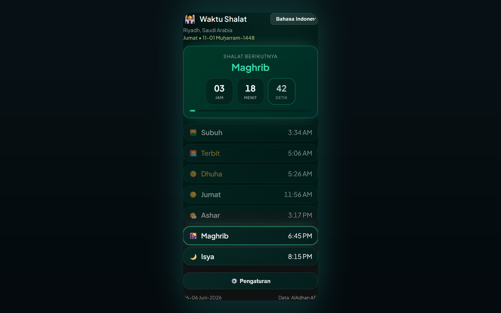

# Prayer Times Reminder — Chrome Extension (Bahasa Indonesia)

> **Jeda Waktu Shalat** — saat waktu shalat tiba, tab Anda yang terbuka terkunci agar Anda bisa menjauh dan shalat.

Ekstensi Chrome (Manifest V3) yang:

- 🔔 **Memberi notifikasi saat setiap waktu shalat tiba** (Fajr, Dhuhr, Asr, Maghrib, Isha) — dalam bahasa yang Anda pilih.
- 🔒 **Kunci tab opsional** — saat waktu shalat tiba, memblokir semua tab browser yang terbuka selama durasi yang dapat diatur (1–120 menit, default 5) dengan overlay hitung mundur; tab yang Anda buka atau kunjungi selama penguncian juga ikut terkunci; opsi buka kunci manual lewat tombol tutup.
- 🕌 **Menampilkan jadwal shalat harian lengkap** untuk kota/negara Anda, dengan hitung mundur langsung ke shalat berikutnya.
- 🌍 **Dropdown negara & kota** — pilih negara, lalu daftar kota dimuat otomatis.
- 🌐 **8 bahasa** — ganti dari header popup atau **Settings → Language** (lihat [Supported languages](#supported-languages)).
- 🌗 **Tema** — Midnight Emerald (default) atau Classic — dapat dipilih di Pengaturan.
- 📅 **Format tanggal** — pilih cara tanggal Hijriah dan Gregorian ditampilkan.
- 🌙 **Tanggal Hijriah** ditampilkan bersama tanggal Gregorian.
- 📿 **Dzikir berkala** — pengingat mengambang opsional dengan 100 frasa unik di tab aktif; ketuk untuk menutup atau hilang otomatis setelah 10 detik.

[English](README.en.md) · [Deutsch](README.de.md) · [العربية](README.ar.md) · [اردو](README.ur.md) · [Français](README.fr.md) · [Español](README.es.md) · [हिन्दी](README.hi.md) · [Bahasa Indonesia](README.id.md)

Waktu shalat berasal dari [AlAdhan API](https://aladhan.com/prayer-times-api) gratis; daftar kota dari [CountriesNow API](https://countriesnow.space) gratis. Tidak perlu kunci API.

## Instalasi

**Pasang dari Chrome Web Store (disarankan):** [Tambahkan ke Chrome](https://chromewebstore.google.com/detail/prayer-times-reminder/knahkbkmbjghaiillhngjbhoinmeegoc)

Atau muat tanpa kemasan untuk pengembangan:

1. Buka `chrome://extensions` di Chrome.
2. Aktifkan **Developer mode** (kanan atas).
3. Klik **Load unpacked** dan pilih folder ini.
4. Klik ikon ekstensi di bilah alat untuk membuka popup.
5. Klik **⚙️ Settings**, pilih **Country** lalu **City** dari dropdown (atau klik **📍 Use my location**), pilih metode perhitungan, lalu **Save & Load**.
6. Pilih bahasa dari dropdown di header popup (atau di **Settings → Language**).

Saat instalasi pertama, tab selamat datang terbuka dengan langkah untuk **menyematkan ekstensi** ke bilah alat Chrome (Chrome tidak mengizinkan ekstensi menyematkan dirinya sendiri).

Selesai — ekstensi akan mengambil waktu hari ini, menampilkannya, dan menjadwalkan notifikasi untuk setiap shalat mendatang. Secara otomatis diperbarui setelah tengah malam untuk hari baru.

> **Notifikasi:** pastikan Chrome diizinkan menampilkan notifikasi sistem di pengaturan OS Anda, jika tidak peringatan tidak akan muncul.

## Pengaturan

| Setting | Description |
|---------|-------------|
| Country / City | Lokasi untuk waktu shalat (atau gunakan geolokasi). |
| Calculation method | Metode AlAdhan (ISNA, Muslim World League, Umm al-Qura, Egyptian, Karachi, Diyanet, dll.). |
| Date format | Cara tanggal Hijriah dan Gregorian ditampilkan. |
| Number style | Saat Arab atau Urdu aktif: angka Arabic-Indic (٠١٢٣) atau Barat (0123). |
| Lock tab during prayer | Menyuntikkan overlay layar penuh di semua tab yang terbuka saat waktu shalat. |
| Lock duration | Berapa lama tab tetap terkunci (1–120 menit). |
| Allow manual unlock | Menampilkan tombol tutup (×) untuk menutup layar kunci lebih awal. |
| Test tab lock | Pratinjau overlay kunci di tab saat ini (berfungsi di situs normal, bukan halaman `chrome://`). |
| Periodic dhikr | Menampilkan dzikir acak di tab aktif pada interval tetap atau acak (1–120 menit). |
| Dhikr position | Sudut atau tengah halaman (atas/bawah × kiri/kanan/tengah). |
| Test dhikr | Pratinjau kartu dzikir di tab saat ini. |
| Theme | Pilih **Midnight Emerald** (default) atau **Classic**. |
| Language | Pilih bahasa UI (juga tersedia di header popup). |

## Bahasa yang didukung

UI, notifikasi, overlay kunci, kartu dzikir, dan halaman selamat datang dilokalkan. Ganti bahasa dari dropdown header popup atau **Settings → Language**.

| Code | Language | Direction | Notes |
|------|----------|-----------|-------|
| `en` | English | LTR | Fallback default jika string hilang |
| `de` | Deutsch (German) | LTR | |
| `ar` | العربية (Arabic) | RTL | Default saat instal pertama; angka Arabic-Indic opsional (٠١٢٣) |
| `ur` | اردو (Urdu) | RTL | Angka Arabic-Indic opsional (٠١٢٣) |
| `hi` | हिन्दी (Hindi) | LTR | |
| `id` | Bahasa Indonesia | LTR | |
| `fr` | Français (French) | LTR | |
| `es` | Español (Spanish) | LTR | |

Terjemahan ada di `i18n.js` (`I18N` + `SUPPORTED_LANGS`). Frasa dzikir di `tasbih-phrases.js` mencakup Arab dengan label per bahasa jika tersedia.

## File

| File | Purpose |
|------|---------|
| `manifest.json` | Manifest MV3 (izin: alarms, notifications, storage, geolocation, tabs, scripting). |
| `background.js` | Service worker — mengambil waktu, menjadwalkan `chrome.alarms`, mengirim notifikasi lokal, mengunci semua tab yang terbuka saat waktu shalat. |
| `content-lock.js` | Overlay disuntikkan (shadow DOM) yang memblokir interaksi halaman sampai timer selesai atau Anda buka kunci manual. |
| `content-tasbih.js` | Kartu dzikir mengambang disuntikkan; tutup dengan ketuk atau setelah 10 detik. |
| `tasbih-phrases.js` | 150 frasa dzikir unik. |
| `welcome.html` / `welcome.css` | Halaman selamat datang instalasi pertama dengan instruksi sematkan ke toolbar (lokal). |
| `i18n.js` | Terjemahan bersama (EN/DE/AR/UR/HI/ID/FR/ES), nama shalat, daftar negara, metode perhitungan, format tanggal, helper digit. |
| `popup.html` / `popup.css` / `popup.js` | UI popup (jadwal, hitung mundur, pemilih bahasa, pengaturan). |
| `theme.css` | Token dan utilitas tema Midnight Emerald bersama (popup, pengaturan, selamat datang). |
| `icons/` | Ikon ekstensi (bulan sabit + bintang). |
| `make_icons.py` | Membuat ulang ikon PNG (dev-only, tidak diperlukan saat runtime). |
| `PRIVACY.md` | Kebijakan privasi ekstensi. |

## Cara kerja

- **Penjadwalan:** saat instalasi/startup dan setiap kali lokasi berubah, service worker mengambil waktu hari ini dan membuat entri `chrome.alarms` sekali pakai pada setiap waktu shalat mendatang, plus alarm refresh tepat setelah tengah malam.
- **Kunci tab:** jika diaktifkan di pengaturan, saat alarm shalat berbunyi ekstensi menyuntikkan `content-lock.js` ke setiap tab yang terbuka dan menampilkan overlay hitung mundur selama durasi yang dikonfigurasi. Overlay memblokir keyboard, scroll, dan input pointer. Tab yang Anda buka atau kunjungi selama jendela penguncian juga ikut terkunci secara otomatis. Aktifkan **Allow manual unlock** untuk tombol tutup (×). Gunakan **Test tab lock** untuk pratinjau di tab saat ini.
- **Pengingat dzikir:** jika diaktifkan, timer `chrome.alarms` menampilkan frasa acak dari `tasbih-phrases.js` di tab aktif pada interval tetap atau acak dalam rentang min/max Anda. Kartu tidak memblokir halaman; ketuk untuk menutup atau tunggu 10 detik.
- **Notifikasi:** saat waktu shalat tiba, notifikasi sistem yang dilokalkan muncul.
- **Popup:** menampilkan jadwal cache secara instan, lalu memperbarui dari jaringan; shalat berikutnya disorot dengan hitung mundur per detik.

## Metode perhitungan

Dropdown pengaturan menampilkan metode AlAdhan umum (ISNA, Muslim World League, Umm al-Qura, Egyptian, Karachi, Diyanet, dll.). Pilih yang sesuai masjid/otoritas lokal Anda untuk waktu paling akurat.

## Privasi

Lihat [PRIVACY.md](PRIVACY.md) untuk data yang disimpan secara lokal dan API pihak ketiga yang dihubungi.

## Lisensi

MIT — lihat [LICENSE](LICENSE).

Demi mengharap wajah Allah Ta'ala, atas nama seluruh kaum Muslimin.

