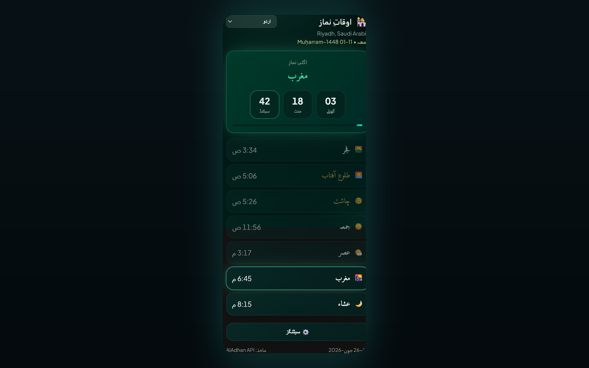

# Prayer Times Reminder — Chrome Extension (اردو)

> **اوقاتِ نماز کا وقفہ** — جب نماز کا وقت آتا ہے تو آپ کے کھلے ٹیبز لاک ہو جاتے ہیں تاکہ آپ اسکرین سے ہٹ کر نماز پڑھ سکیں۔

یہ Chrome (Manifest V3) ایکسٹینشن:

- 🔔 **ہر نماز کے وقت پر** نوٹیفکیشن بھیجتی ہے (Fajr, Dhuhr, Asr, Maghrib, Isha) — آپ کی منتخب کردہ زبان میں۔
- 🔒 **اختیاری ٹیب لاک** — جب نماز کا وقت آئے تو ایک قابلِ ترتیب مدت (1–120 منٹ، ڈیفالٹ 5) کے لیے تمام کھلے براؤزر ٹیبز کو بلاک کرتی ہے، ساتھ ہی کاؤنٹ ڈاؤن اوورلے بھی ہوتا ہے؛ لاک کے دوران آپ جو ٹیبز کھولیں یا جن پر جائیں وہ بھی خودکار طور پر کور ہو جاتے ہیں؛ کلوز بٹن کے ذریعے دستی ان لاک کا اختیاری آپشن۔
- 🕌 **روزانہ نمازوں کا مکمل شیڈول** آپ کے شہر/ملک کے لیے دکھاتی ہے، اور اگلی نماز تک لائیو کاؤنٹ ڈاؤن کرتی ہے۔
- 🌍 **ملک اور شہر کے ڈراپ ڈاؤن** — ملک منتخب کریں، تو شہر کی فہرست خودکار طور پر لوڈ ہو جاتی ہے۔
- 🌐 **8 زبانیں** — popup ہیڈر سے یا **Settings → Language** سے سوئچ کریں (دیکھیں [Supported languages](#supported-languages))۔
- 🌗 **Theme** — Midnight Emerald (ڈیفالٹ) یا Classic — Settings میں منتخب کیا جا سکتا ہے۔
- 📅 **Date format** — Hijri اور Gregorian دونوں تاریخیں کس طرح دکھانی ہیں منتخب کریں (مثلاً `10-04-2026`, `10 April 2026`, طویل متن)۔
- 🌙 **Hijri date** — Gregorian تاریخ کے ساتھ دکھائی جاتی ہے۔
- 📿 **Periodic dhikr** — اختیاری فلوٹنگ ریمائنڈر جس میں فعال ٹیب پر 100 منفرد جملے ہوتے ہیں؛ چھپانے کے لیے دبائیں یا 10 سیکنڈ بعد خودکار طور پر ہٹ جائے گا۔
- 📿 **Periodic dhikr** — اختیاری فلوٹنگ ریمائنڈر جس میں فعال ٹیب پر 150 منفرد جملے ہوتے ہیں؛ چھپانے کے لیے دبائیں یا 10 سیکنڈ بعد خودکار طور پر ہٹ جائے گا۔

[English](README.en.md) · [Deutsch](README.de.md) · [العربية](README.ar.md) · [اردو](README.ur.md) · [Français](README.fr.md) · [Español](README.es.md) · [हिन्दी](README.hi.md) · [Bahasa Indonesia](README.id.md)

نمازوں کے اوقات مفت [AlAdhan API](https://aladhan.com/prayer-times-api) سے آتے ہیں؛ شہر کی فہرست مفت [CountriesNow API](https://countriesnow.space) سے آتی ہے۔ کوئی API کیز درکار نہیں۔

## انسٹال

**Chrome Web Store سے انسٹال کریں (تجویز کردہ):** [Chrome میں شامل کریں](https://chromewebstore.google.com/detail/prayer-times-reminder/knahkbkmbjghaiillhngjbhoinmeegoc)

یا ڈیولپمنٹ کے لیے اسے ان پیکڈ لوڈ کریں:

1. Chrome میں `chrome://extensions` کھولیں۔
2. اوپر دائیں طرف **Developer mode** آن کریں۔
3. **Load unpacked** پر کلک کریں اور یہ فولڈر منتخب کریں۔
4. ٹول بار میں ایکسٹینشن آئیکن پر کلک کر کے popup کھولیں۔
5. **⚙️ Settings** پر کلک کریں، ڈراپ ڈاؤن سے اپنی **Country** اور پھر **City** منتخب کریں (یا **📍 Use my location** پر کلک کریں)، حساب کا طریقہ منتخب کریں، پھر **Save & Load** کریں۔
6. popup ہیڈر کے ڈراپ ڈاؤن سے اپنی زبان منتخب کریں (یا **Settings → Language** میں)۔

پہلی بار انسٹال کے بعد، ایک خوش آمدید ٹیب کھلے گا جس میں Chrome ٹول بار میں ایکسٹینشن کو **pin** کرنے کے مراحل ہوں گے (Chrome خود بخود ایکسٹینشن کو pin نہیں کرنے دیتا)۔

یہی ہے — ایکسٹینشن آج کے اوقات لے کر دکھائے گی اور ہر اگلی نماز کے لیے نوٹیفکیشن شیڈول کرے گی۔ نئے دن کے لیے یہ آدھی رات کے بعد خودکار طور پر تازہ ہو جاتی ہے۔

> **Notifications:** اپنے OS سیٹنگز میں یقینی بنائیں کہ Chrome کو سسٹم نوٹیفکیشن دکھانے کی اجازت ہے، ورنہ الرٹس نظر نہیں آئیں گے۔

## Settings

| Setting | Description |
|---------|-------------|
| Country / City | نمازوں کے لیے استعمال ہونے والا مقام (یا geolocation استعمال کریں)۔ |
| Calculation method | AlAdhan طریقہ (ISNA, Muslim World League, Umm al-Qura, Egyptian, Karachi, Diyanet، وغیرہ)۔ |
| Date format | Hijri اور Gregorian دونوں تاریخیں کس طرح دکھائی جاتی ہیں۔ |
| Number style | جب Arabic یا Urdu فعال ہو: Arabic-Indic (٠١٢٣) یا Western (0123) اعداد اوقات اور کاؤنٹ ڈاؤن کے لیے۔ |
| Lock tab during prayer | نماز کے وقت تمام کھلے ٹیبز پر مکمل صفحہ اوورلے ڈالتی ہے۔ |
| Lock duration | ٹیب کتنی دیر لاک رہے گا (1–120 منٹ)۔ |
| Allow manual unlock | لاک اسکرین کو جلدی بند کرنے کے لیے (×) کلوز بٹن دکھاتی ہے۔ |
| Test tab lock | موجودہ ٹیب پر لاک اوورلے کی پیش نظارہ (عام ویب سائٹس پر کام کرتا ہے، `chrome://` صفحات پر نہیں)۔ |
| Periodic dhikr | فعال ٹیب پر مقررہ یا بے ترتیب وقفے پر (1–120 منٹ) ایک رینڈم dhikr دکھاتی ہے۔ |
| Dhikr position | صفحے کا کونہ یا درمیان (اوپر/نیچے × بائیں/دائیں/درمیان)۔ |
| Test dhikr | موجودہ ٹیب پر dhikr کارڈ کا پری ویو۔ |
| Theme | **Midnight Emerald** (ڈیفالٹ) یا **Classic** منتخب کریں۔ |
| Language | UI کی زبان منتخب کریں (یہ popup ہیڈر میں بھی موجود ہے)۔ |

## Supported languages

UI، نوٹیفکیشنز، لاک اوورلے، dhikr کارڈ، اور خوش آمدید پیج لوکلائز کیے گئے ہیں۔ زبان تبدیل کرنے کے لیے popup ہیڈر کے ڈراپ ڈاؤن یا **Settings → Language** استعمال کریں۔

| Code | Language | Direction | Notes |
|------|----------|-----------|-------|
| `en` | English | LTR | اگر کسی متن کی کمی ہو تو ڈیفالٹ فال بیک |
| `de` | Deutsch (German) | LTR | |
| `ar` | العربية (Arabic) | RTL | پہلی بار انسٹال پر ڈیفالٹ؛ اختیاری Arabic-Indic numerals (٠١٢٣) |
| `ur` | اردو (Urdu) | RTL | اختیاری Arabic-Indic numerals (٠١٢٣) |
| `hi` | हिन्दी (Hindi) | LTR | |
| `id` | Bahasa Indonesia | LTR | |
| `fr` | Français (French) | LTR | |
| `es` | Español (Spanish) | LTR | |

ترجمے `i18n.js` میں ہیں (`I18N` + `SUPPORTED_LANGS`)۔ `tasbih-phrases.js` میں dhikr جملے عربی سمیت شامل ہیں، جہاں دستیاب ہوں وہاں زبان کے مطابق لیبل بھی موجود ہوتے ہیں۔

## Files

| File | Purpose |
|------|---------|
| `manifest.json` | MV3 مینِفیسٹ (permissions: alarms, notifications, storage, geolocation, tabs, scripting)۔ |
| `background.js` | سروس ورکر — اوقات لاتا ہے، `chrome.alarms` شیڈول کرتا ہے، لوکلائز نوٹیفکیشن دکھاتا ہے، اور نماز کے وقت تمام کھلے ٹیبز لاک کرتا ہے۔ |
| `content-lock.js` | Injected overlay (shadow DOM) جو ٹائمر ختم ہونے تک یا صارف کے دستی ان لاک تک صفحے کی انٹر ایکشن روک دے۔ |
| `content-tasbih.js` | Injected floating dhikr کارڈ؛ دبانے پر یا 10 سیکنڈ بعد غائب۔ |
| `tasbih-phrases.js` | 150 منفرد dhikr فقرے۔ |
| `welcome.html` / `welcome.css` | پہلی بار انسٹال کے لیے خوش آمدید صفحہ، pin-to-toolbar ہدایات کے ساتھ (لوکلائز)۔ |
| `i18n.js` | مشترکہ ترجمے (EN/DE/AR/UR/HI/ID/FR/ES)، نمازوں کے نام، ملکوں کی فہرست، حساب کے طریقے، تاریخ کی فارمیٹس، اور اعداد کا مددگار۔ |
| `popup.html` / `popup.css` / `popup.js` | popup UI (شیڈول، کاؤنٹ ڈاؤن، زبان کا انتخاب، سیٹنگز)۔ |
| `icons/` | ایکسٹینشن آئیکنز (ہلال + ستارہ)۔ |
| `make_icons.py` | PNG آئیکنز دوبارہ بناتا ہے (صرف dev کے لیے؛ runtime میں ضروری نہیں)۔ |
| `PRIVACY.md` | ایکسٹینشن کی پرائیویسی پالیسی۔ |

## How it works

- **Scheduling:** انسٹال/اسٹارٹ اپ پر اور جب بھی لوکیشن تبدیل ہو، service worker آج کے timings لاتا ہے اور ہر آنے والی نماز کے وقت پر `chrome.alarms` کے ایک شاٹ اندراجات بناتا ہے، ساتھ ہی آدھی رات کے فوراً بعد refresh alarm بھی۔
- **Tab lock:** اگر settings میں فعال ہو تو، جب نماز کا الارم بجتا ہے تو ایکسٹینشن ہر کھلے ٹیب میں `content-lock.js` inject کرتی ہے اور مقررہ مدت کے لیے کاؤنٹ ڈاؤن اوورلے دکھاتی ہے۔ یہ اوورلے صفحے پر کی بورڈ، اسکرول اور pointer input کو بلاک کرتا ہے۔ لاک کے دورانیے میں آپ جو ٹیبز کھولیں یا جن پر جائیں وہ بھی خودکار طور پر لاک ہو جاتے ہیں۔ **Allow manual unlock** کو فعال کریں تاکہ (×) کلوز بٹن دکھے۔ موجودہ ٹیب پر پیش نظارہ کے لیے settings میں **Test tab lock** استعمال کریں۔
- **Dhikr reminder:** اگر فعال ہو تو، `chrome.alarms` ٹائمر `tasbih-phrases.js` سے ایک رینڈم جملہ فعال ٹیب پر مقررہ وقفے یا min/max رینج کے اندر بے ترتیب وقفے پر دکھاتا ہے۔ کارڈ صفحہ بلاک نہیں کرتا؛ چھپانے کے لیے دبائیں یا 10 سیکنڈ انتظار کریں۔
- **Notifications:** جب نماز کا وقت آتا ہے تو ایک لوکلائزڈ سسٹم نوٹیفکیشن ظاہر ہوتا ہے۔
- **Popup:** محفوظ کردہ شیڈول فوراً رینڈر ہوتا ہے، پھر نیٹ ورک سے ریفریش ہوتا ہے؛ اگلی نماز کو سیکنڈ بہ سیکنڈ کاؤنٹ ڈاؤن کے ساتھ نمایاں کیا جاتا ہے۔

## Calculation methods

Settings ڈراپ ڈاؤن عام AlAdhan طریقے دکھاتا ہے (ISNA, Muslim World League, Umm al-Qura, Egyptian, Karachi, Diyanet، وغیرہ)۔ اپنے مقامی مسجد/ادارے کے مطابق جو بہتر لگے وہ منتخب کریں تاکہ اوقات زیادہ درست ہوں۔

## Privacy

کون سا ڈیٹا لوکل طور پر محفوظ ہوتا ہے اور کن تھرڈ پارٹی API کو رابطہ کیا جاتا ہے، اس کے لیے [PRIVACY.md](PRIVACY.md) دیکھیں۔

## License

MIT — [LICENSE](LICENSE) دیکھیں۔
